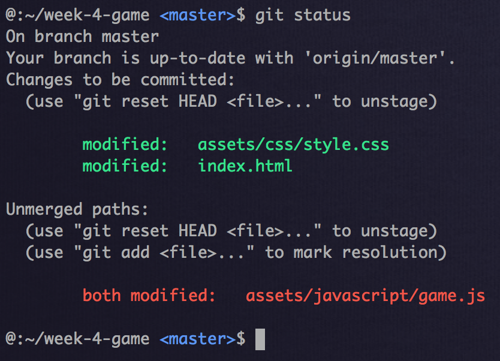

# Version Control

## What is Version Control
In the simplest form, version control is a way to keep record of changes to your program overtime. It is a common way for software engineers work on projects incrementally.

## Popular Version Controls
There are many types of version controls. Here are a list of a few of the most popular

- 
- 
- 

Follow the links to learn more about the different version control options.

For our Soul Encoded tutorials, we will be focusing on Git.

## The Problem And Solution
Here is a simple example of a problem that Git solves for software engineers.

Step 1: A engineer writes and saves the code.
Step 2: A engineer changes the code and saves over his previous changes
Step 3: A engineer realizes that he actually needs the changes that he saved over.

If we did not have version control for this example we would not have access to the code that we saved over.
So the first problem that Git solves for us is providing a **history**

With Git, we can go back to the previous point we committed in our history.

Another big problem that Git solves is dealing with collaborations between many engineers. Imagine for a moment if you and I started writing a essay together, and we are both working on the same section of the essay. Eventually we would need to **merge** our work together in a smart and precise way. Git solves this problem for us.

## Essentials

In this section we will go over the bare essentials you need to work on the Git Soul Encoded challenge.

### Terminologies and Concepts

When working with git there are a few terminologies and concepts that you need to understand

- **Staging**: For all changes that are made they will be either un-staged or staged. This means, that they are either ready to be committed or not yet ready to be committed
- **Committed**: This is essentially saving the staged changes, but it also creates a node

- **Nodes**: a node is a unique point in time in our git history.  

a general work flow would be as follows:

Step 1: A engineer writes and saves codes.
Step 2: A engineer adds the saved changes to the staging area.
Step 3: A engineer will commit those changes and thus creating a node in our history, this also clears the staging area.

- **Branching**: The best way I can describe branching is with a multiverse example. Imagine a timeline where someone starts a alternate universe. Branching is essentially creating a new timeline in our git history.

- **Merging**: Merging is used to merge two branches back into one branch. One note is that when you initialize git into your project, you create a default **master** branch.

### Most common commands
`git init`: Initializes git control of your project.

`git status`: Displays which files have been changed and which files are currently in the staging area.

`git add`: Adds saved changes to the staging area.

`git commit`: Creates a node in our git history with all the saved changes in the staging area.

`git log`: Displays our git history and all nodes.

`git checkout`: creating and jumping into new branches.

`git branch`: manage your branches

`git merge`: Combines two branches into one.

These are just some of the basics that you will need to complete the below challenge but feel free to dig through the [Official Documentations](https://git-scm.com/doc). A firm understanding of git is vital to your journal to become a software engineer.

Note some git commands has flags e.g. `git commit -m "commit message here"` the `-m` stands for message and the `"commit message here"` is the string that will be saved as a message. You will need to figure out the flags and parameters to complete the below challenges.

HINT: `git add`, `git checkout`, and `git merge` will need flags or parameters to use.

## Github vs Git
So a lot of new engineers get confused by Git vs Github. We will go over Github in the next sections, but basically Github is a web based version control service that hosts your projects in a online repository.

In simple terms, Github can save your project online in a repository, then you can use Git to make changes to your repository.

Most importantly, Github uses Git. Github has a few additional commands that you will need to learn in the next section.

## Challenge

Prerequisites for this challenge
- [IDE](https://github.com/SoulEncoded/IDE)
- [Command Line]()

In this challenge do the following:

1. Create a new project in your workspace and initialize git control
2. Create a new javascript file and add `console.log('hello');` to the first line
3. Commit these changes
4. Create and Checkout a new branch
5. Reopen the javascript file and change the code on the same line to `console.log('new branch');`
6. Merge this new branch back into your master
7. Resolve your merge conflicts and make one final commit with the changes from the merge.

With these steps you have gone through a major work flow using git.

## Solution

Steps:

1. Using Command Line create a new folder called `git_challenge` in your workspace.
2. Change into the `git_challenge` directory initialize git control with `git init`.
3. Using Command Line create a new file called `awesome_code.js`.
5. Open the file `awesome_code.js` in your IDE and write `console.log('hello');`.
6. (Optional). In your CLI type in `git status` to view your un-staged changes to the project.
7. add your changes to the staging are by entering `git add awesome_code.js` or `git add .` to add all your changes.
8. (Optional). `git status` again to see your changes in the staging area.
9. `git commit -m "add console log to awesome_code file"`. Note by convention commit messages are present tense.
10. create and checkout a new branch `git checkout -b new_branch`
11. in your new branch open the `awesome_code.js` file and change the code to `console.log('new branch');`.
12. Follow steps 7 - 9 and commit your changes with a new different commit message.
13. Go back to your master branch. `git checkout master`
14. Merge your new_branch into the master branch with `git merge new_branch`

We will cover merge conflicts in a separate lessons
